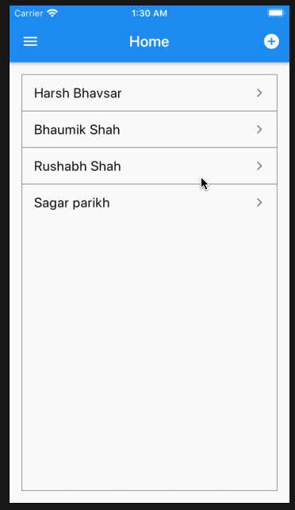
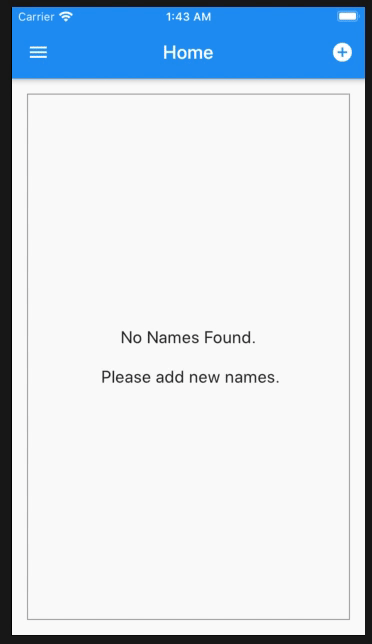
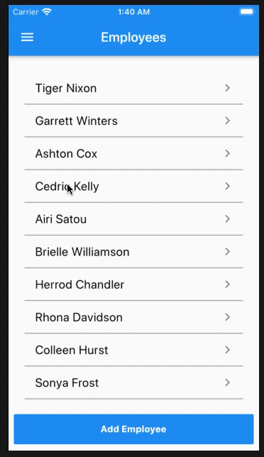

## Provider-Play

#### This repository contains simple use of multi-provider, providers, listenable-provider, consumers and changeNotifiers.

| Navigation Changes -  Provider | Name List - Add - Get Provider | Employee Data - Add-Get API Provider
|-----------------------------------------------------------------------------------------------------------------------------|-------------------------------------------------------------------------------------------------------------------------------|-------------------------------------------------------------------------------------------------------------------------------
| |  |  

### Created By

[Harsh Bhavsar](https://github.com/iharshb) ([@harshu_719](https://www.twitter.com/harshu_719)) 

### Credits

[Sahil Kumar's ](https://github.com/xsahil03x) ([Medium Article](https://medium.com/flutter-community/handling-network-calls-like-a-pro-in-flutter-31bd30c86be1)) 

For help getting started with Flutter, view our online
[documentation](https://flutter.io/).
